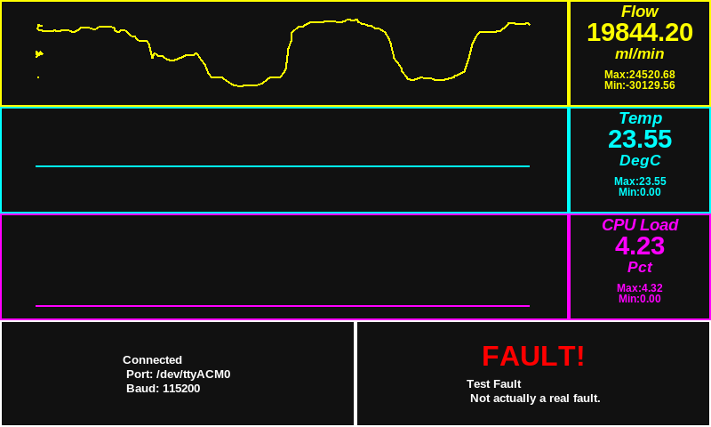

# VIP Pi User Interface

A simple user interface and arduino test code for an MIT-inspired ventilator design.

# WARNING
THE SOFTWARE IS PROVIDED "AS IS". 

IT IS NOT FIT FOR ANY PARTICULAR PURPOSE, CONFORMS TO NO REGULATORY BODY REQUIREMENTS, AND IS GENERALLY NOT SAFE FOR ANY APPLICATION INVOLVING LIVING ORGANISMS. 

USE AT YOUR OWN RISK.

# Pi Interface

Tk-based python GUI application which reads data from a serial port and creates time-series plots of it, updated in real time.

# Arduino Tests

## basicCounterPrint 

Uses arduino analog input 1 and internal counters to generate three signals for testing the GUI.

## Sensor Test

Contains basic implementation for the following:

1. Periodic loop execution
2. Watchdog Timer
3. Floating-point data transmit
4. BMC280 pressure/temp/humidity sensor reading over I2C
5. FS6122 flowmeter sensor reading over I2C

## To-Do

1. Save wdog reset events to EEPROM
2. Create & integrate infrastructure for logging and reporting system faults
3. Add pi->arduino communication via touchscreen button presses

# About Ventilators In Peoria

A team of volunteers looking to replicate successes of the [MIT E-Vent Project](https://e-vent.mit.edu/) to fill medical community needs in the Peoria, IL area.
